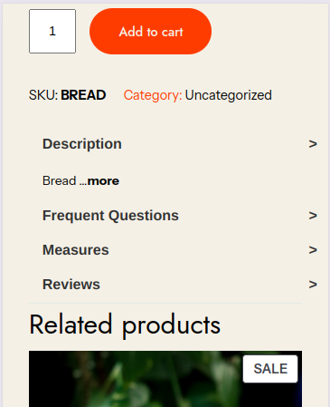

# responsive_tabs
wordpress woocommerce plugin that shows product custom tabs horizontally on wide screens, and vertically with side panel that slides from the right side with ease in small screens

# wide screen horizontal tabs

# small screen vertical tab

and side panel

# how it works?
* simply the default woocommerce product description will display inside the first tab called "Description"
* other tabs need to be created by the plugin "Advanced Custom Fields" where the name of each field should match the name set in our tabs plugin in the php file, lines from 40 to 49 from the "get_field" name definitions.
* the tab itself will be WYSISYG type
* there are checkboxes to make tabs show/hide as you desire and it can be created in the plugin "Advanced Custom Fields" with type true\false.
* the Reviews tab will show reviews automatically once there are some reviews for the product.
